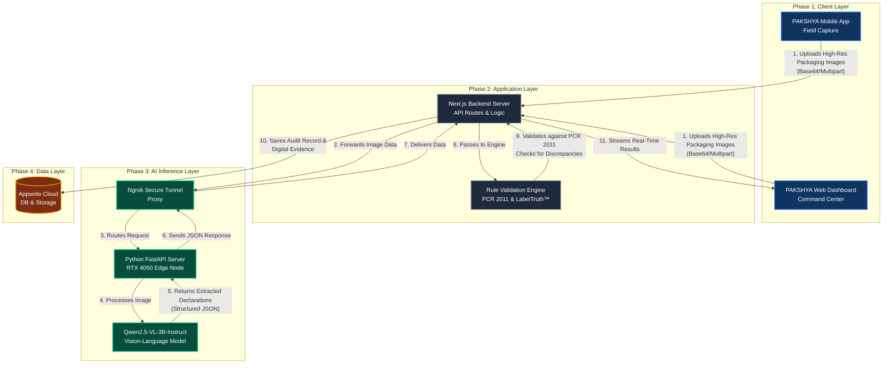

# PAKSHYA System Architecture & Flowchart

This document outlines the complete end-to-end technical architecture of the PAKSHYA platform, illustrating how data flows from the field inspector's device through our AI processing core and into the final compliance dashboard.

## System Flowchart

The following diagram illustrates the lifecycle of a single inspection audit within the PAKSHYA ecosystem.

---

## Architectural Components Breakdown

### 1. The Client Presentation Layer (Frontend)
Built using **React** and **Next.js**, utilizing **Tailwind CSS** for a highly responsive, modern glassmorphism UI.
- **Mobile Companion App:** Used by field inspectors for high-precision, multi-angle optical scanning of product packaging. 
- **Web Command Center:** A desktop dashboard used by higher-level officials to monitor real-time nationwide compliance data, manage inspector profiles, and review auto-generated Show-Cause notices.

### 2. The Application Logic Layer (Backend)
Powered by **Next.js Serverless API Routes** and Node.js.
- **API Gateway:** Acts as the central orchestrator, handling authentication, routing, and data sanitization.
- **Rule Validation Engine:** This is the core logic engine. It takes the raw text extracted by the AI and runs it against programmed rule-sets based on the *Legal Metrology (Packaged Commodities) Rules, 2011*.
- **LabelTruth™ Algorithm:** A proprietary cross-verification module that specifically compares front-panel marketing claims (e.g., "₹50 Promo Price") against back-panel legal realities (e.g., "MRP ₹45") to detect "Dual MRP" fraud and shrinkflation anomalies.

### 3. The AI Inference Layer (Edge Processing)
Because heavy Vision-Language Models cannot run directly in the browser or on standard serverless edge functions, we utilize a split-pipeline architecture.
- **Secure Tunneling (Ngrok):** Bridges the public Next.js server with the local GPU-accelerated server securely.
- **Python FastAPI/Flask Wrapper:** A lightweight, high-performance web framework serving as the bridge to the AI model.
- **Qwen2.5-VL-3B-Instruct-AWQ:** The heart of the platform. A highly advanced, quantized multimodal model running on a dedicated RTX 4050 GPU. It processes images, understands spatial layouts on curved packaging, and extracts exact text for the 7 mandatory declarations with extremely high accuracy.

### 4. The Persistence Layer (Database)
Managed via **Appwrite Cloud** (BaaS).
- **Document Store:** Stores all structured JSON data regarding product inspections, inspector profiles, and generated reports.
- **Storage Buckets:** Securely houses the raw image evidence (photos of the packaging) and the auto-generated PDF Show-Cause notices.
- **Cryptographic Hashing:** Ensures that once an inspection record is saved, it is immutable and verifiable, preventing evidence tampering.

---

## The Request Lifecycle (Step-by-Step)
1. **Capture:** Inspector takes a photo of the product using the mobile app.
2. **Transmit:** Image is sent to the Next.js API.
3. **Inference:** Next.js sends the image via an Ngrok tunnel to the Python FastAPI server. The Qwen2.5-VL model processes the image and extracts the necessary text (MRP, Net Weight, etc.) into a structured JSON object.
4. **Validation:** The Python server returns the JSON to Next.js, which passes the data into the Rule Validation Engine.
5. **Verdict:** The Engine flags discrepancies, assigns a confidence score, and determines an overall 'PASS/FAIL' status.
6. **Storage:** The final report and images are saved to Appwrite.
7. **Display:** The dashboard instantly updates with the compliance badges, the audit ledger, and the option to generate a formal PDF notice.
