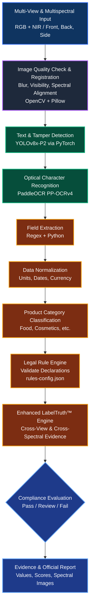

# PAKSHYA: AI-Powered Legal Metrology Inspection Portal

**Smart India Hackathon (SIH) Problem Statement: SIH26034**  
*Automation of compliance checking for Packaged Commodities under the Legal Metrology (Packaged Commodities) Rules, 2011.*

---

## 1. EXECUTIVE SUMMARY

PAKSHYA is a comprehensive, end-to-end digital governance platform designed to revolutionize how Legal Metrology Officers inspect packaged commodities.

By replacing manual and error-prone field audits with a high-precision AI-powered inspection pipeline, PAKSHYA helps ensure statutory compliance, reduce human bias, and identify deceptive packaging practices such as Dual MRP and Shrinkflation.

The core innovation of PAKSHYA is its **deterministic AI pipeline**. Instead of relying on a generic Large Language Model to interpret legal information (which risks hallucination), the system uses specialized Computer Vision and OCR technologies:

* **YOLOv8** for targeted detection of statutory text regions on packaging.
* **PaddleOCR** for high-accuracy text extraction.
* **Regex and Python-based processing** for field extraction.
* A strict JSON-based **Legal Rule Engine** for deterministic compliance validation.
* A **Multi-View & Multispectral Evidence Engine** for detecting conflicting information across different sides of the package and analyzing surface/ink anomalies.

This architecture ensures that the system relies strictly on factual, verifiable evidence—assisting the officer with data, not inventing it.

---

## 2. TECHNICAL ARCHITECTURE & AI WORKFLOW

The PAKSHYA workflow is designed to handle challenging retail packaging (curved, reflective, skewed) through a rigorous multi-stage pipeline.

---

## 3. DETAILED PIPELINE BREAKDOWN

### 3.1 Data Ingestion and Pre-Processing
* **Multi-View Input:** The system accepts multiple images of the same product from different angles (Front, Back, Side, Top). This is vital because legally required declarations are rarely present on a single side.
* **Image Quality Check:** Before performing computationally expensive AI processing, OpenCV and Pillow evaluate image blur, visibility, and brightness. Poor images are rejected immediately, prompting a retake and preventing unreliable OCR results.

### 3.2 Core AI Engine: Detection and Recognition
* **Text Detection (YOLOv8):** PAKSHYA uses a custom-trained `YOLOv8x-P2` model running through PyTorch. It identifies regions likely to contain statutory information, separating them from graphics, logos, and advertisements.
* **Optical Character Recognition (PaddleOCR):** The cropped regions are passed to `PP-OCRv4`. PaddleOCR easily handles dense packaging text, skewed text, multiple languages, and challenging retail layouts.

### 3.3 Data Processing and Structuring
* **Field Extraction (Python + Regex):** Converts unstructured OCR output into 7 primary extraction targets: Product Name, Manufacturer, Net Quantity, MRP, Batch Number, Mfg/Pack Date, and Expiry Date.
* **Data Normalization:** Converts varying formats (`Rs. 50`, `₹50`, `INR 50`) into standardized representations (`₹50`). Similarly, `500 g` and `0.5 kg` are mathematically unified.
* **Product Category Classification:** Categorizes the item (Food, Cosmetics, Household) to apply the correct subset of statutory requirements.

### 3.4 Legal Validation
* **Legal Rule Engine (`rules-config.json`):** Evaluates the normalized data against the *Legal Metrology (Packaged Commodities) Rules, 2011*. It deterministically checks if MRP is present, if net quantity is properly formatted, and if mandatory fields exist, providing traceable compliance decisions.

---

## 4. MULTISPECTRAL IMAGING & ADVANCED EVIDENCE ANALYSIS

To further strengthen inspection capabilities, PAKSHYA incorporates **Multispectral Imaging** as an advanced evidence layer. Traditional RGB cameras capture visible light, but packaging alterations, different inks, and surface anomalies often remain hidden. 

### 4.1 Multispectral Data Acquisition & Pre-Processing
Officers capture normal RGB images alongside **Near-Infrared (NIR)** or other spectral bands. The system aligns these (Spectral and Spatial Registration) to analyze the exact same physical region across multiple wavelengths. Pre-processing includes noise reduction, illumination correction, and contrast enhancement.

### 4.2 Multispectral OCR & Tampering Analysis
* **Enhanced OCR:** If text is unreadable due to glare, faded ink, or packaging texture in RGB, the system can select a cleaner spectral representation before passing it to PaddleOCR, dramatically boosting confidence scores.
* **Tampering Analysis:** Comparing spectral characteristics helps identify overprinted labels, altered dates, replaced stickers, or inconsistent ink usage. While not automatic proof of fraud, it flags the item for strict human review.

---

## 5. KEY INNOVATION: ENHANCED LABELTRUTH™ ALGORITHM

LabelTruth™ is our proprietary multi-view and multispectral evidence engine. It abandons the idea of treating each image independently; instead, it establishes a single "truth representation" of the product.

The enhanced system evaluates:
1. Textual & Spatial Evidence
2. Cross-View Consistency (e.g., Front panel says "PROMO ₹40", Back panel says "MRP ₹45" -> Dual MRP Fraud).
3. Spectral Evidence (Does a price tag look like a separately applied, non-standard sticker under NIR?).
4. OCR & Detection Confidence Scores.

---

## 6. FINAL OUTPUT & ENFORCEMENT

PAKSHYA compiles an **Evidence Confidence Model** to determine if the evidence is strong enough for automated processing, resulting in one of three states:

* 🟢 **PASS:** All applicable declarations are detected, and no significant inconsistency is identified.
* 🔴 **FAIL:** A configured legal violation is detected with sufficient supporting evidence (e.g., missing MRP, verifiable Dual MRP).
* 🟡 **REVIEW:** The system detects insufficient, conflicting, or suspicious evidence (e.g., severe glare, low OCR confidence, or a spectral anomaly like different ink used on the expiry date). 

### Evidence and Official Report Generation
The objective is an auditable evidence trail. The final report contains bounding box images, extracted values, rule-by-rule results, and confidence scores, ready to support the generation of a formal **Show-Cause Notice**.

---

## 7. HARDWARE DEPLOYMENT: TWO-LEVEL ARCHITECTURE

To ensure national scalability while maintaining advanced capabilities, PAKSHYA operates on a practical two-level hardware architecture:

* **LEVEL 1 (Standard Inspection):** Uses a standard smartphone RGB Camera -> YOLOv8 -> PaddleOCR -> Rule Engine -> LabelTruth™.
* **LEVEL 2 (Advanced Inspection):** For high-risk or inconclusive cases, a dedicated Multispectral/NIR device is deployed -> Spectral Analysis -> Evidence Fusion -> Advanced LabelTruth™ -> Officer Verification.

---

## 8. EXPECTED IMPACT & CONCLUSION

By combining **Computer Vision, OCR, deterministic legal rules, Multi-View analysis, and Multispectral evidence**, PAKSHYA transforms Legal Metrology from a subjective manual process into an evidence-driven, scalable digital workflow.

**The governing principle of PAKSHYA:**  
*"AI should assist the officer with evidence, not invent the evidence."*

PAKSHYA provides a transparent, auditable, and lightning-fast foundation for nationwide packaged-commodity compliance checking.
